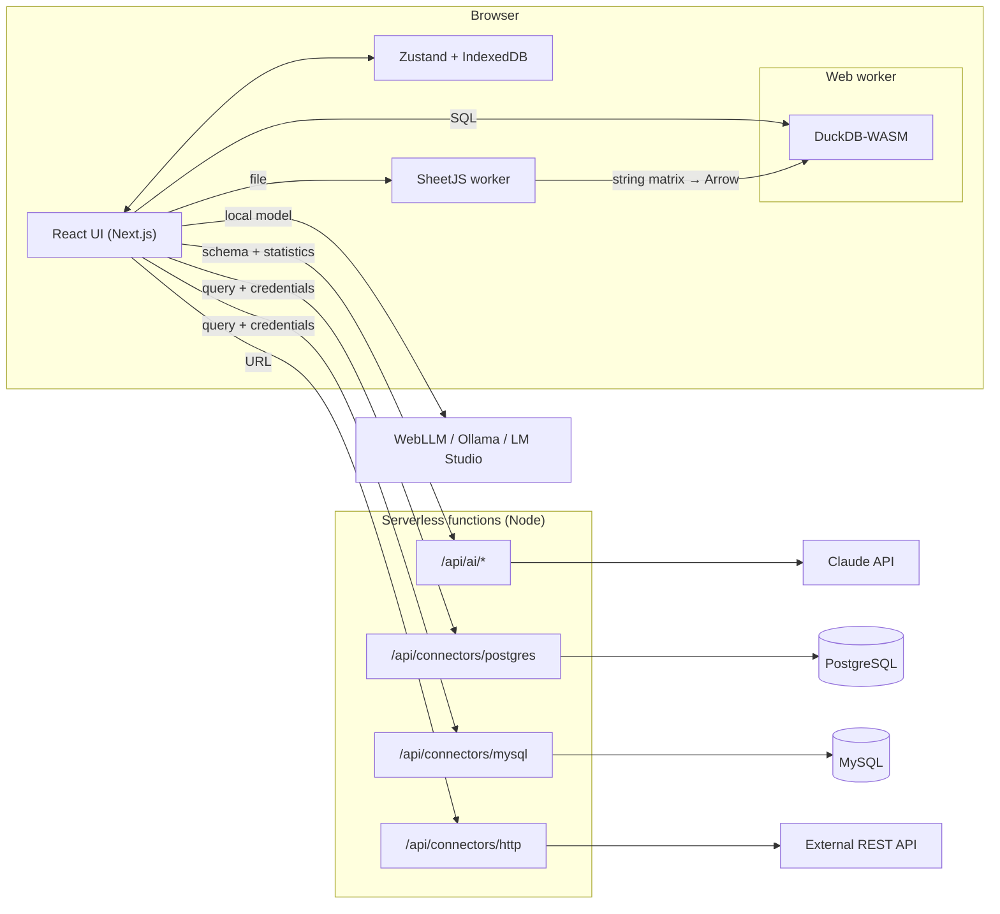

# Architecture

Dash the Data is a local-first BI tool. Heavy work (parsing, clean-up, queries) runs in the browser
with DuckDB-WASM in a web worker; the server only hosts thin, stateless functions (AI proxy, database
connectors, HTTP proxy).



## Data flow

```
Source → [ingest] → raw_<id> (all VARCHAR, __row keeps the original order)
       → [pipeline: one SQL view per step] → clean_<datasetId> (materialised, typed)
       → [profiling] → ColumnProfile[]
       → [suggestion engine] → ChartSpec[]
       → [queryBuilder] → SQL → DuckDB → rows → [echartsOption] → chart
```

## Model

Union suggestions align columns by normalised display name and stack the clean tables with `UNION ALL`.
Relationship detection compares id and dimension columns; accepted relationships become a left-join
dataset. `ensureModelView` recreates those views after reload (`viewBuilders` in `restore.ts`).

## Connectors

`/api/connectors/postgres`, `/api/connectors/mysql` and `/api/connectors/http` are stateless.
SQL must be a single `SELECT`/`WITH` (`sqlGuard`). HTTP and database hosts must be public unless
`CONNECTORS_ALLOW_PRIVATE=true` (`ssrf`). Passwords are not stored on the project. `GET /api/demo/orders`
is a tiny JSON sample. `docker-compose.yml` starts local Postgres and MySQL.

## AI

`POST /api/ai/ask` sends a schema summary to Claude, with an optional `x-api-key` (BYOK, session only)
and an hourly rate limit (Upstash when configured, otherwise in memory). The browser can also call
WebLLM or a local Ollama/OpenAI-compatible server. Consent is stored on the project settings.

## Release notes

The landing mark animates on first paint unless the user prefers reduced motion. `/privacy` describes
what stays on the device. Dashboard screenshots from the phase 6 browser pass live in `test-results/`
after `npm run test:e2e` (light and dark). A walkthrough GIF is not generated in CI.
