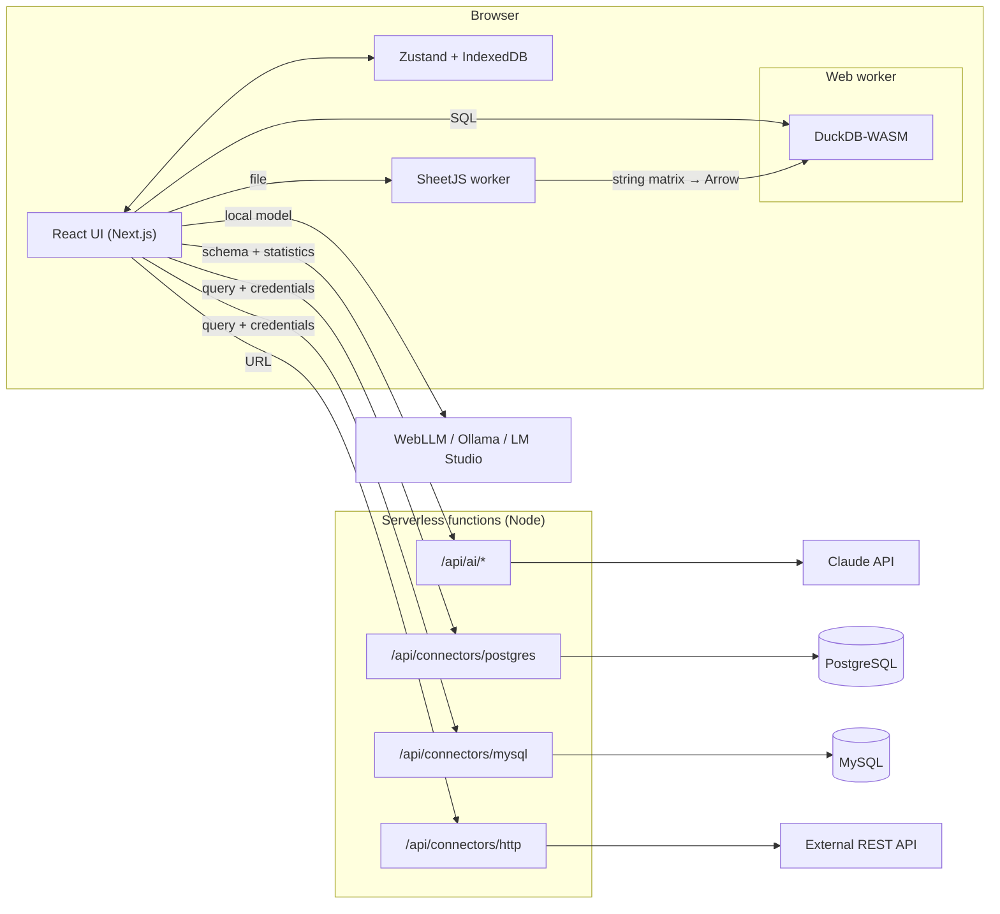

# Architecture

Dash the Data is a local-first BI tool. Heavy work (parsing, clean-up, queries) runs in the browser
with DuckDB-WASM in a web worker; the server only hosts thin, stateless functions (AI proxy, database
connectors, HTTP proxy).



## Data flow

```
Source → [ingest] → raw_<id> (all VARCHAR, __row keeps the original order)
       → [pipeline: one SQL view per step] → clean_<datasetId> (materialised, typed)
       → [profiling] → ColumnProfile[]
       → [suggestion engine] → ChartSpec[]
       → [queryBuilder] → SQL → DuckDB → rows → [echartsOption] → chart
```

The sections below are filled in as the phases land.
